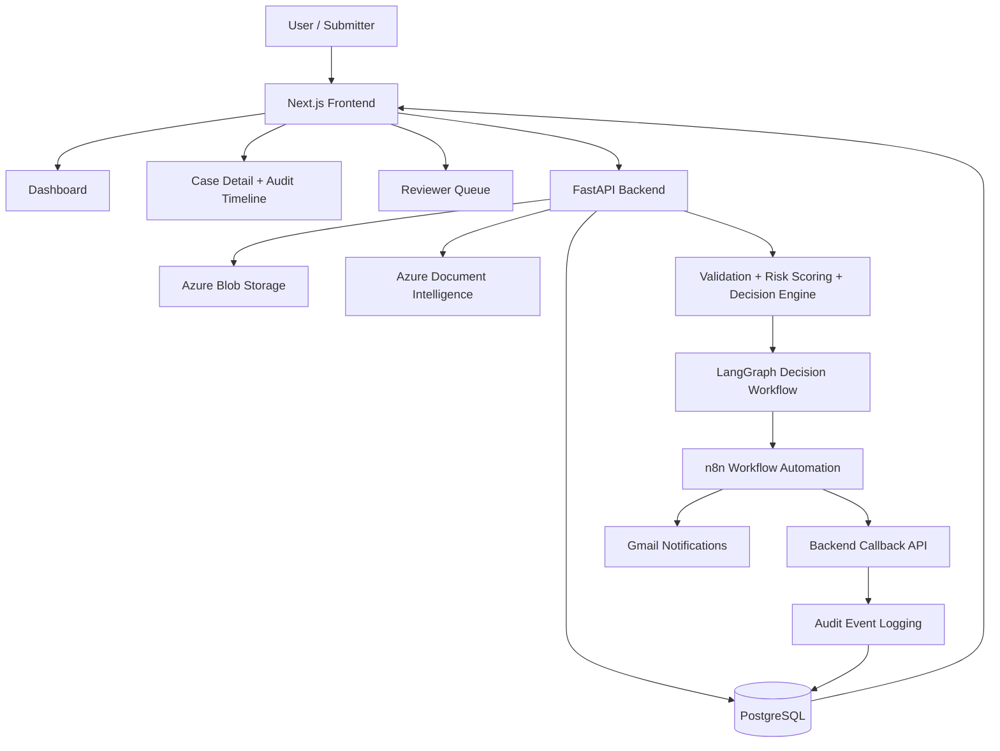
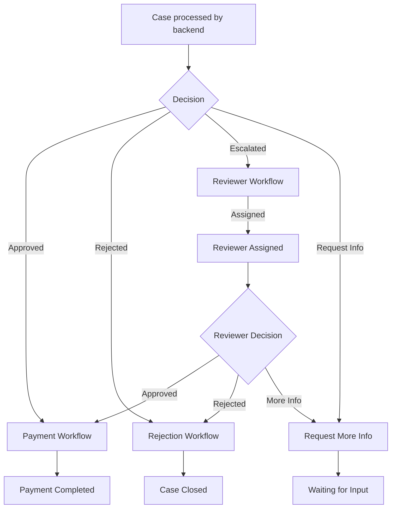

# Autonomous Finance Operations Copilot

AI-powered finance workflow platform for invoice processing, risk scoring, human review, and audit traceability.

Built with FastAPI, PostgreSQL, Azure Document Intelligence, LangGraph, and n8n.

---

## Key Features

- AI-assisted document extraction and validation  
- Deterministic risk scoring and decision engine (approve / reject / escalate)  
- Human-in-the-loop review workflows for escalated cases  
- n8n-based automation for notifications, approvals, and reminders  
- End-to-end audit trail with full workflow traceability  
- Reviewer queue and executive dashboard for operational visibility  

---

## Architecture

---

## Workflow Automation (n8n)

---

## End-to-End Flow

1. Invoice uploaded and stored  
2. Azure Document Intelligence extracts structured data  
3. Backend validates and scores risk  
4. Decision engine determines approve, reject, or escalate  
5. LangGraph orchestrates workflow and human review  
6. n8n handles operational workflows (notifications, approvals, reminders)  
7. All actions are logged in an audit timeline  

---

## UI Overview

- Dashboard: operational metrics and case distribution  
- Cases: full audit timeline and workflow state  
- Reviewer Queue: human-in-the-loop decision management  

---

## Tech Stack

- Frontend: Next.js, Tailwind CSS  
- Backend: FastAPI  
- Database: PostgreSQL  
- AI: Azure Document Intelligence  
- Orchestration: LangGraph  
- Automation: n8n  

---

## What This Project Demonstrates

- AI-assisted business workflow design  
- Human-in-the-loop decision systems  
- Stateful workflow orchestration  
- Integration of backend services with automation platforms  
- Audit-driven system design for operational transparency  

---

## Future Improvements

- Role-based access control  
- Policy configuration system  
- Event-driven workflow triggers  
- Production deployment and monitoring  

---

## Setup

See detailed setup instructions:

- Backend: `./backend`
- Frontend: `./frontend`

---

## Notes

This is a production-style portfolio project designed to demonstrate enterprise-grade workflow automation and AI-assisted decision systems.

---

## System in Action

### Case Audit Timeline

This timeline captures the full lifecycle of a case, including AI decisioning, escalation, reviewer assignment, workflow automation, and final resolution.
